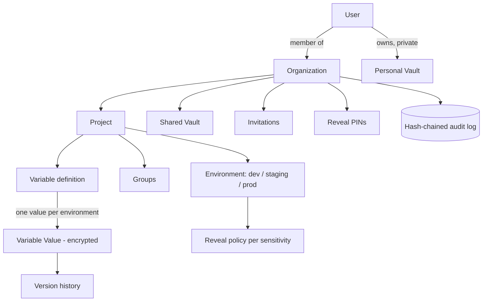
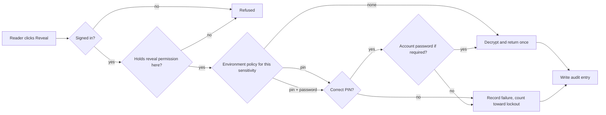

<div align="center">


# The Vault

### A self-hosted secrets manager for teams that treat `.env` like it matters.

Store, share, version and audit environment variables and credentials with per-environment reveal policies, hash-chained audit trails, and deny-by-default access. No roles to reason about, no plaintext in a list response, nothing that changes without a record.


</div>

---

## Table of contents

- [What is The Vault](#what-is-the-vault)
- [Principles](#principles)
- [Data model](#data-model)
- [Feature tour](#feature-tour)
  - [Accounts and sign-in](#1-accounts-and-sign-in)
  - [Invitations and membership](#2-invitations-and-membership)
  - [Permissions and grants](#3-permissions-and-grants)
  - [Organizations](#4-organizations)
  - [Projects](#5-projects)
  - [Environments and reveal policy](#6-environments-and-reveal-policy)
  - [Variables](#7-variables)
  - [Smart import and classification](#8-smart-import-and-classification)
  - [Reveal, PINs and lockout](#9-reveal-pins-and-lockout)
  - [Personal vault](#10-personal-vault)
  - [Shared vault](#11-shared-vault)
  - [Tags](#12-tags)
  - [The audit log](#13-the-audit-log)
  - [Dashboards](#14-dashboards)
- [The reveal flow](#the-reveal-flow)
- [The permission catalogue](#the-permission-catalogue)
- [Tech stack](#tech-stack)
- [Getting started](#getting-started)
- [Everyday workflows](#everyday-workflows)
- [Console commands](#console-commands)
- [Testing and quality](#testing-and-quality)
- [Project structure](#project-structure)
- [Security notes](#security-notes)

---

## What is The Vault

The Vault is an internal, self-hosted platform for storing and managing the secrets an application needs to run: database URLs, API keys, tokens, signing secrets, certificates, and the plain configuration that sits next to them in a `.env` file.

It is built for teams. A credential is defined once for a project, given a different value in each environment (dev, staging, prod), and revealed only to the people who are allowed to see it, only after they pay whatever that environment asks for it: nothing, a PIN, or a PIN and their account password. Every reveal, every change, and every refused attempt is written to a tamper-evident log.

Alongside the team vaults, every person gets a **personal vault** that no administrator can read, and every organization gets a **shared vault** for the credentials a team passes around.

---

## Principles

These four rules shape every screen and every endpoint.

| Principle | What it means in practice |
|-----------|---------------------------|
| **Secrets are radioactive** | List and index responses never contain a secret value, only masked metadata. A value is decrypted and returned by exactly one path, the reveal guard. Values are encrypted at rest everywhere they live: current values, version history, uploaded files, and audit properties. |
| **Everything is audited** | Every mutation writes to a hash-chained, append-only log, including the failures: a wrong PIN, a denied permission, a lockout. There is no setting that turns auditing off. |
| **Deny by default** | There are no roles. Access is a chain of explicit grants: organization membership, then organization, project and environment permissions, resolved in one place. Nothing is implicit. |
| **Client is UX, server is truth** | Every form validates in the browser for a fast, honest experience, and the server re-validates everything it receives. The two rule sets are kept in step. |

---

## Data model



A **variable** is defined once for a project (its key, sensitivity, group and tags). Its **value** is set per environment and encrypted at rest. Reading a value is a **reveal**, and what a reveal costs is decided by the **environment's policy** for that value's sensitivity.

---

## Feature tour

Every feature, grouped by area.

### 1. Accounts and sign-in

- **Email and password** sign-in.
- **Google sign-in** through OAuth, for accounts that use it.
- **Mandatory two-factor authentication.** Every account is protected by a TOTP authenticator app. There are deliberately no recovery codes; if someone loses their authenticator, an administrator resets it with a single command (see [Console commands](#console-commands)).
- **Guided onboarding** in a fixed order: set a password, set up two-factor, then complete a profile. The account is not usable until each step is done.
- **Password reset** by email for password accounts. Invited accounts cannot reset a password they never set; they get in by accepting their invitation.
- **Email verification** and a **password-confirmation gate** in front of the actions that guard secrets.
- **A new-sign-in email on every login.** The moment an account signs in (after the two-factor code, and for Google sign-in too), it is emailed the details of that login - the time, the IP address, and the browser and device - with a prompt to change the password if it was not them. A wrong password sends nothing, and the alert is queued so it can never slow or block a sign-in.
- **A 24-hour session.** A sign-in lasts a day of activity before it expires and asks for the two-factor code again; sensitive account screens re-ask for the password every three hours on top of that.

### 2. Invitations and membership

- **Invite by email, granting access at the same time.** Inviting someone is granting them access: you choose the exact permissions, scope by scope, in the invite dialog. The account and its grants are created immediately and lie inert until the invitation is accepted.
- **Accept, resend and revoke.** Accepting an invitation authenticates the invitee (holding the token proves they control the inbox) and starts onboarding. Pending invitations can be resent or revoked; revoking deletes the reserved account and its pre-granted access.
- **Pending invitations** are listed on the organization overview.

### 3. Permissions and grants

- **No roles.** A person holds exactly the permissions they were granted, each pinned to a scope: the whole organization, one project, or one environment. A wider grant lights up every narrower scope beneath it.
- **One resolver.** Membership, then organization, project and environment permissions are resolved in a single place and never re-decided anywhere else.
- **A visible matrix.** The members screen shows every permission against every environment, so you can see at a glance what a person can do and where. Editing access is a checklist, not a role picker.
- **Last-manager protection.** The system will not let you strip the final person who can manage members, so an organization can never lock everyone out.

### 4. Organizations

- Create, rename and delete organizations.
- An organization holds projects, members, invitations, tags, a shared vault, reveal PINs, and its own rolled-up activity feed.
- Starting new organizations is itself a permission, granted per account.

### 5. Projects

- Create, rename and delete projects. Deleting is reversible: values and history are kept.
- **Per-project security settings**: how many wrong PIN attempts trigger a lockout, how long the lockout lasts, and whether reveals are written to the audit log (changes are always recorded, regardless).
- Each project carries its own environments, groups, members and permission matrix, variables, diff, audit log and import screen.

### 6. Environments and reveal policy

- Projects ship with **dev, staging and prod**, and you can add, rename or remove environments.
- Each environment has a **reveal policy matrix**: for each sensitivity level (public, sensitive, critical) you choose what a reveal costs.

| Requirement | What the reader must provide |
|-------------|------------------------------|
| **No PIN** | Nothing. The value is shown on request. |
| **PIN** | Their four-digit reveal PIN. |
| **PIN + password** | Their PIN and their account password. |

This is why dev can run wide open while prod demands a PIN and your password for anything critical.

### 7. Variables

- **Define once, value per environment.** A variable has a key (`SCREAMING_SNAKE_CASE`), a sensitivity, an optional group and tags. Its value is set independently in each environment and encrypted at rest.
- **Three sensitivity levels**: public, sensitive, critical. Public values are the only ones that can appear inline, and only when the environment's policy and the reader's grants both allow it. Everything else is masked until revealed.
- **Change-safety flag.** Mark a variable as "breaks on change" and the UI warns before edits, so nobody quietly rotates the one key a deploy depends on.
- **Groups.** Organize variables into groups. Create a group on its own (empty, ahead of its contents), rename it inline, delete it (its variables survive, ungrouped), or name the ungrouped bucket to adopt every loose variable into a new group at once.
- **Version history and rollback.** Every value change is a new version. Roll back to an earlier one and the rollback is itself recorded as a new version, so history is never rewritten.
- **Copy a group** as `.env` lines, with secret values left blank for you to fill after revealing.
- **Environment diff.** Compare two environments and learn which keys differ or are missing, without ever learning what either value is.
- **Completeness.** The overview shows which keys are missing in which environment, so an incomplete environment is visible before a deploy finds out.

### 8. Smart import and classification

- **Import a `.env` by paste or drop** (up to 195 KB, `.env` or plain text). The file is read in the browser and parsed with the same engine Laravel uses, so quoting and escapes behave exactly as they do at runtime.
- **Smart sensitivity.** A single classifier guesses each variable's sensitivity from its key and value: a connection string with an embedded password, a private key block, a recognised token shape (`sk_live_`, `AKIA...`, a JWT) or a high-entropy blob is treated as critical; endpoints and identifiers as sensitive; plain configuration and booleans as public. It leans safe when unsure.
- **Smart grouping.** The same classifier files new variables into groups by provider (Database, Cache, Queue, Mail, Payments, Auth, AI, AWS, Google Cloud, Observability and more), and clusters unknown providers by shared prefix. The import preview shows the groups before anything is written.
- **The same classifier suggests a sensitivity** as you type a key into the New Variable dialog, and pre-selects a matching existing group. Your choice always wins.
- **Export** an environment as a `.env` file, gated by its own permission and written to the audit log.

### 9. Reveal, PINs and lockout

- **The one door.** A secret value is only ever decrypted and returned through the reveal guard, which checks, in order: session, permission, the environment policy, the PIN and password when required, the rate limit, and then writes an audit entry.
- **Reveal PINs.** An administrator issues each member a four-digit reveal PIN, separate from their password. A PIN can be blocked to stop that person revealing immediately, without touching their account or their access, and re-activated later.
- **Lockout.** After a configurable number of wrong PIN attempts, reveals lock for a configurable window. Every wrong attempt and every lockout is audited.

### 10. Personal vault

- A **private space for every user** that no owner, admin or anyone else can read, by design rather than by permission.
- Store **secrets and files**, organized into groups.
- Reveal a value in place, preview or download a stored file, edit or rotate a value, and delete items.
- A **private activity trail** visible only to you, which never reaches any organization feed.

### 11. Shared vault

- A **team space at the organization level** for the credentials a team passes around: passwords, keys and files.
- Everything is **encrypted at rest**, and **reading one always asks for your PIN**.
- Files are stored encrypted and streamed on download, never handed over as a page prop.
- Organized into groups, with create, edit and delete.

### 12. Tags

- **Labels with a reach.** A tag's scope (organization-wide, one project, or one environment) is fixed when it is created, which is what keeps a label like "prod-only" meaningful.
- Attach tags to variables to slice and filter them by concern.

### 13. The audit log

- **Every mutation is recorded**, and so are the failures: denied permissions, wrong PINs, lockouts.
- **Hash-chained and append-only.** Each entry is linked to the one before it, and database triggers refuse any update or delete, so the log cannot be quietly edited.
- **Anchoring.** The latest chain hash can be stored outside the database, so tampering is provable even against someone with database access.
- **Verification.** A single command re-walks the chain and reports whether the log has been altered.
- **Filter and page** the log by success or failure, at the organization or project level. A member only sees other people's entries if they hold the "view all activity" permission, and only for the environments they can see.
- **The one exception.** There is a single, permissioned way to remove entries: wiping one organization's activity. It drops the triggers for one transaction, removes the rows, re-links the chain, and writes an indelible marker recording who wiped it, how many rows went, and the chain head that stood before. A wipe launders the history before it; that cost is accepted, recorded, and never hidden.

### 14. Dashboards

- **Personal dashboard**: everything you have been added to, and your recent activity everywhere.
- **Organization dashboard**: projects and their completeness, members and pending invites, failed PINs, incomplete environments, and a rolled-up activity chart.
- **Project dashboard**: variable and sensitivity counts, per-environment completeness, and recent activity.
- **Light and dark themes** throughout, with a consistent design system.

---

## The reveal flow

The single path a secret value takes to reach a browser.



The value is shown once, in place, and never becomes a page prop, a history entry, or part of a partial reload.

---

## The permission catalogue

Twenty-four permissions, each granted per scope. There are no roles bundling them.

| Scope | Permission | Grants the ability to |
|-------|------------|-----------------------|
| Environment | `variables.view` | See a variable's masked metadata |
| Environment | `variables.reveal` | Reveal a value (subject to the policy) |
| Environment | `variables.export` | Export an environment as `.env` |
| Environment | `variables.create` | Create variables |
| Environment | `variables.update` | Set and change values |
| Environment | `variables.rollback` | View history and roll back |
| Environment | `variables.import` | Import a `.env` |
| Environment | `variables.delete` | Delete variables |
| Project | `settings.update` | Change project settings |
| Project | `environments.manage` | Add, rename and remove environments and policies |
| Project | `groups.manage` | Create, rename and delete groups |
| Project | `tags.create` | Create project and environment tags |
| Organization | `organization.update` | Rename the organization |
| Organization | `organization.delete` | Delete the organization |
| Organization | `projects.create` | Create projects |
| Organization | `members.invite` | Invite people |
| Organization | `members.manage` | Change what members can do |
| Organization | `audit.view-all` | See everyone's activity, not just your own |
| Organization | `audit.wipe` | Wipe an activity log (the one destructive power) |
| Organization | `shared.view` | See the shared vault |
| Organization | `shared.reveal` | Reveal shared secrets |
| Organization | `shared.manage` | Add, edit and delete shared secrets |
| Organization | `pins.manage` | Issue and block reveal PINs |
| Organization | `tags.create-global` | Create organization-wide tags |

---

## Tech stack

**Backend**

- PHP 8.3, Laravel 13
- Laravel Fortify (authentication, two-factor), Socialite (Google sign-in)
- Inertia (Laravel adapter), Wayfinder (typed routes for the frontend)
- Spatie Activitylog (audit trail), Sluggable, Tags
- Resend (transactional email)
- MySQL in development and production, SQLite in the test suite

**Frontend**

- React 19, TypeScript 5.7
- Inertia 2, Vite 8
- Tailwind CSS 4 with a token-based design system, Geist and Geist Mono
- shadcn/ui primitives (Radix) composed into the app's own components
- react-hook-form and Zod for full client-side validation
- Recharts, lucide-react, sonner, cmdk

---

## Getting started

### Requirements

- PHP 8.3 or newer, Composer
- Node 20 or newer, npm
- MySQL 8 (or MariaDB)

### Install

```bash
# 1. Install dependencies, copy .env, generate a key, run migrations, build assets
composer setup

# 2. Create your MySQL database and point .env at it
#    DB_CONNECTION=mysql, DB_DATABASE=..., DB_USERNAME=..., DB_PASSWORD=...
#    then, if you did not run it above:
php artisan migrate
```

### Configure the essentials

Open `.env` and set what you need:

```dotenv
APP_NAME="The Vault"
APP_URL=http://127.0.0.1:8000

DB_CONNECTION=mysql
DB_DATABASE=vault
DB_USERNAME=root
DB_PASSWORD=

# Email: "log" writes to the log file in development.
# Set to "resend" and add RESEND_KEY in production.
MAIL_MAILER=log

# Optional: Google sign-in
GOOGLE_CLIENT_ID=
GOOGLE_CLIENT_SECRET=

# Optional: seed a ready-made local owner account (dev only)
OWNER_EMAIL=owner@example.test
OWNER_PASSWORD=change-me-please
```

### Create your first account

```bash
# Interactive, safe to run once at install
php artisan vault:create-first-user

# Allow that account to start organizations
php artisan vault:allow-organizations you@example.com
```

Or, in local development, seed a ready-made owner (needs `OWNER_EMAIL` and `OWNER_PASSWORD` in `.env`):

```bash
php artisan db:seed --class=DevOwnerSeeder
```

### Run it

```bash
composer dev
```

This starts the PHP server, the queue worker and Vite together. Open `http://127.0.0.1:8000`, sign in, and set up two-factor on first sign-in by scanning the QR with an authenticator app.

---

## Everyday workflows

**Set up a team space**

1. Sign in and create an **organization** from the dashboard.
2. Create a **project** inside it. It arrives with dev, staging and prod.
3. Open **Settings** and set each environment's reveal policy: for example, dev open, staging PIN, prod PIN and password for critical values.

**Add secrets**

4. On the **Variables** screen, add a variable (its key, sensitivity and group are suggested for you), or use **Import** to paste a whole `.env` and let it group and classify everything.
5. Switch environment tabs and **Set** each value. Values are encrypted the moment they are saved.

**Bring in your team**

6. **Invite by email** and tick exactly the permissions each person should have, per environment.
7. Issue each member a **reveal PIN** from the members screen.

**Use it day to day**

8. **Reveal** a value when you need it: depending on the policy you are asked for nothing, your PIN, or your PIN and password. The value shows once.
9. **Roll back** a value from its history if a change went wrong.
10. Check the **Diff** and **completeness** views before a deploy, and read the **audit log** to see who did what.

**Keep private things private**

11. Use your **Personal vault** for your own credentials and files. Nobody else can read them.
12. Use the organization's **Shared vault** for the credentials your team passes around; reading one always asks for your PIN.

---

## Console commands

| Command | What it does |
|---------|--------------|
| `php artisan vault:create-first-user` | Create the first account, run once at install |
| `php artisan vault:allow-organizations {email}` | Allow (or revoke) an account's ability to start organizations |
| `php artisan vault:reset-two-factor {email}` | Clear an account's two-factor so they can set it up again |
| `php artisan vault:anchor-audit-chain` | Store the latest audit chain hash outside the database |
| `php artisan vault:verify-audit-chain` | Verify that the audit log has not been altered |

---

## Testing and quality

```bash
php artisan test        # Pest feature suite (runs on in-memory SQLite)
npx tsc --noEmit        # TypeScript type check
npm run lint            # ESLint
vendor/bin/pint         # PHP formatting
vendor/bin/phpstan analyse   # PHP static analysis
```

Every feature ships with its own test file, covering the happy paths per role, authorization denials at every scope, guest access, validation failures, the security behavior (wrong PIN, lockout, values never appearing in responses) and the audit entry each action must write.

---

## Project structure

```
app/
  Actions/        One class per use case, grouped by domain
  Services/
    Access/       AccessResolver and the grant guards: the whole permission chain
    Audit/        AuditRecorder, the hash chain, the append-only triggers, verifier
    Reveal/       RevealGuard: the only path that decrypts and returns a value
    Env/          EnvParser, EnvClassifier (smart sensitivity and grouping), Diff
    Dashboard/    The payloads each screen renders
  Policies/       Authorization, always calling the resolver, never re-deciding
  Http/           Thin controllers and Form Requests
resources/js/
  pages/          One folder per URL area (auth, dashboard, organizations, projects, personal)
  components/vault/   The app's own composed components
  components/ui/      Generated shadcn primitives
  lib/            Validation schemas (Zod), the env classifier mirror, helpers
config/           Standard Laravel config
database/         Migrations, factories, seeders
tests/Feature/    Pest tests, one file per feature
```

---

## Security notes

- **Values never travel in a list response.** Only the reveal guard decrypts, and only after every check passes.
- **Encrypted at rest everywhere.** Current values, version history, uploaded files and any secret in an audit entry.
- **The audit log is append-only** at the database level, with the single, recorded exception of a permissioned wipe.
- **Nothing real belongs in the repository.** Tests, seeders and examples use obviously fake values only; real credentials live in `.env`, which is never committed.
- Inertia's request-recording devtools are disabled on purpose: a tool that writes request and response bodies to disk has no place in a secrets manager.
